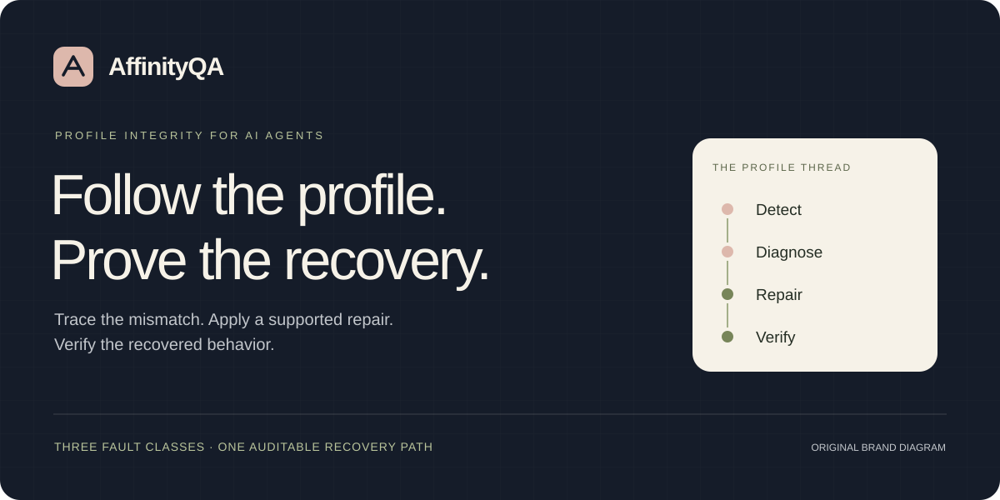
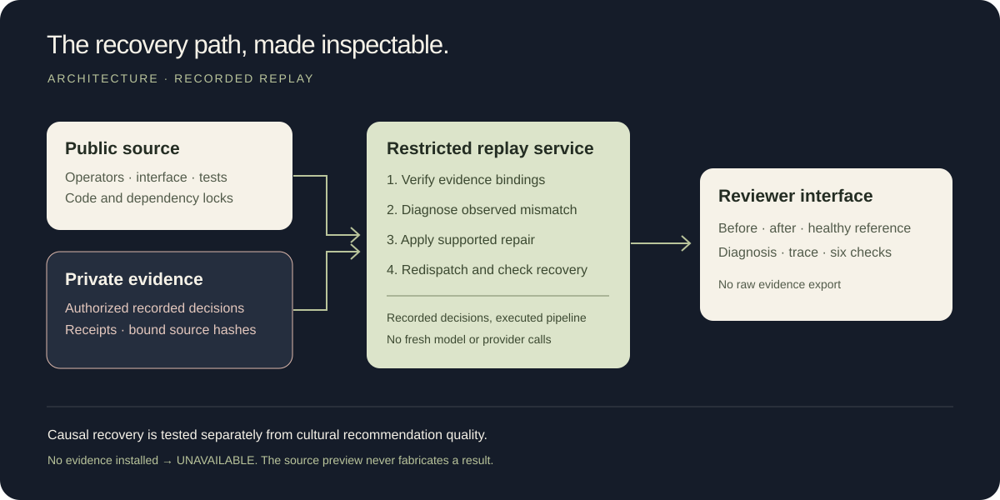

# AffinityQA

**Follow the profile. Prove the recovery.**

AffinityQA detects when a personalized AI agent loses the requested profile, diagnoses the routing fault, applies a supported repair and checks whether the correct behavior returns. Inspect the identity trace and replay the recovery in a focused reviewer interface.

[Quickstart](#quickstart) · [Architecture](#architecture) · [Local evidence](#local-evidence) · [Reviewer guide](docs/DEMO-GUIDE.md) · [MIT license](LICENSE)

## What it does

- **Find the broken profile link.** Compare requested, transmitted, tool and output identities.
- **Explain a supported cause.** Distinguish three faults through observed traces.
- **Repair the actual pipeline.** Change routing or cache configuration, then dispatch again.
- **Show the proof.** Compare before, after and recorded healthy decisions with six explicit checks.

The reviewer replay uses previously recorded local-model decisions. It executes the routing, diagnosis and repair pipeline again, with **zero new model or Qloo calls**. The initial capture and its provider-derived evidence are separate from this public source repository.

## Three faults. Three explicit repairs.

| Injected fault | Diagnosis | Repair operation |
| --- | --- | --- |
| Cache key omits the profile | `CACHE_OMITS_PROFILE` | `set-profile-cache` — include profile identity in cache scope |
| A stale profile reaches the agent | `STALE_PROFILE` | `restore-request-profile` — route the current request |
| The tool context belongs to another profile | `WRONG_TOOL_PROFILE` | `bind-request-tool` — bind tool input to the request |

**Detect → Diagnose → Repair → Verify.** Select an incident, inspect the mismatch, replay its supported repair and compare the recovered output with the recorded healthy reference. Unsupported or ambiguous traces do not become successful repairs.

## Architecture



Both images are original vector diagrams, not product screenshots or provider outputs. The restricted service exposes a summary and one selected replay; raw evidence exports and live inference are excluded. `/healthz` checks process liveness, not evidence readiness.

## Quickstart

**Toolchain used for the current preparation:** Python **3.12.14**, Node.js **24.19.0**, pnpm **11.25.0**. Run from the repository root. Install those runtimes separately; the commands below install project dependencies. Linux commands are provided for portability and have not been validated as a hosted Linux deployment.

### 1. Install Python dependencies and run source tests

**Windows · PowerShell**

```powershell
& "C:\path\to\python.exe" -m venv .venv
.\.venv\Scripts\python.exe -m pip install -r requirements-backend.lock.txt
.\.venv\Scripts\python.exe -m unittest discover -s tests -v
```

Replace the interpreter path with your installed Python 3.12.14 executable; the optional Windows `py` launcher is not required.

**Linux · shell**

```bash
python3.12 -m venv .venv
.venv/bin/python -m pip install -r requirements-backend.lock.txt
.venv/bin/python -m unittest discover -s tests -v
```

### 2. Build the interface

The same commands work in PowerShell and a Linux shell:

```text
cd web
npx --yes pnpm@11.25.0 install --frozen-lockfile --ignore-scripts
npx --yes pnpm@11.25.0 typecheck
npx --yes pnpm@11.25.0 build
cd ..
```

The lockfile fixes dependency resolution; install lifecycle scripts are disabled. The explicit application build runs afterward. Package installation requires registry access.

### 3. Open the local source preview

| Platform | Command |
| --- | --- |
| Windows | `.\.venv\Scripts\python.exe scripts/serve_public_demo.py --origin http://127.0.0.1:8767 --port 8767` |
| Linux | `.venv/bin/python scripts/serve_public_demo.py --origin http://127.0.0.1:8767 --port 8767` |

Open **http://127.0.0.1:8767/demo/**. Without separately authorized evidence, the preview reports **UNAVAILABLE**. It does not replace real evidence with fabricated results. Stop the process with Ctrl+C.

### 4. Replay an authorized capture

Use an evidence directory, run ID and receipt hash provided by its owner. With the platform-specific Python executable above, run:

```text
python scripts/serve_public_demo.py --origin http://127.0.0.1:8767 --port 8767 --evidence-root "<ABSOLUTE_AUTHORIZED_DIRECTORY>" --run-id "<OWNER_PROVIDED_RUN_ID>" --receipt-sha256 "<OWNER_PROVIDED_SHA256>"
```

Verify the complete recorded replay separately:

```text
python scripts/verify_public_demo.py --evidence-root "<ABSOLUTE_AUTHORIZED_DIRECTORY>" --run-id "<OWNER_PROVIDED_RUN_ID>" --receipt-sha256 "<OWNER_PROVIDED_SHA256>"
```

These `python` examples mean the virtual-environment interpreter, not an arbitrary system executable. See the [full setup guide](docs/PUBLIC-CODE-QUICKSTART.md) and [reviewer click path](docs/DEMO-GUIDE.md).

## Local evidence

Recorded local checks as of **4 October 2026**. These are dated observations, **not a passing CI badge** or an independently verified hosted deployment. Private capture material is not shipped here.

| Check | Recorded result | What it establishes |
| --- | --- | --- |
| Source-only engineering suite | **81 tests passed** | Packaged source behavior with synthetic test fixtures |
| Full project engineering suite | **380 tests passed** | Broader local regression coverage; requires the full project environment |
| Restricted recorded replay | **54 selections passed** | Six pairs × three fault classes × three repeats |
| Initial validation capture | **234 model calls · 24 Qloo requests** | Recorded acquisition cost; replay does not repeat these calls |
| Causal incident validation | **18/18 cases passed** | Profile-integrity recovery under the captured protocol |
| Cultural recommendation quality | **NOT_VALIDATED** | Causal repair is not proof of better personal taste matching |

**Deployment status:** hosted URL pending. Source, local replay and a future external service have separate acceptance checks. Dependency versions and advisories must be reviewed again for the deployment revision; no current security certification is implied by these test counts.

## Repository map

| Path | Purpose |
| --- | --- |
| [`src/affinityqa/`](src/affinityqa/) | Profile integrity, diagnosis, repair, replay and API operators |
| [`scripts/`](scripts/) | Local preview, verification and audit entry points |
| [`web/`](web/) | Next.js reviewer interface and locked frontend dependencies |
| [`tests/`](tests/) | Source-only engineering tests |
| [`docs/`](docs/) | Setup, reviewer flow, deployment boundaries and licensing |
| [`deployment/`](deployment/) | Reviewed hosting preparation; does not create a service by itself |
| [`evals/`](evals/) | Evaluation definitions |
| [`fixtures/`](fixtures/) | Explicitly synthetic test inputs |

## Documentation

| Start here | Read next |
| --- | --- |
| [Source setup and commands](docs/PUBLIC-CODE-QUICKSTART.md) | [Reviewer demonstration guide](docs/DEMO-GUIDE.md) |
| [Restricted deployment contract](docs/PUBLIC-DEMO-DEPLOYMENT.md) | [Deployment preparation](deployment/README.md) |
| [Asset provenance](docs/ASSET-PROVENANCE.md) | [Licensing scope](docs/LICENSING.md) |

## License and data

Original AffinityQA code is **MIT licensed**, © 2026 Seypher. See [LICENSE](LICENSE) and [third-party notices](docs/THIRD-PARTY-LICENSES.txt).

Qloo responses, recorded provider outputs, model materials and third-party assets retain their own rights. Their display or redistribution requires separate authorization. Keep credentials and private evidence outside the public repository.
